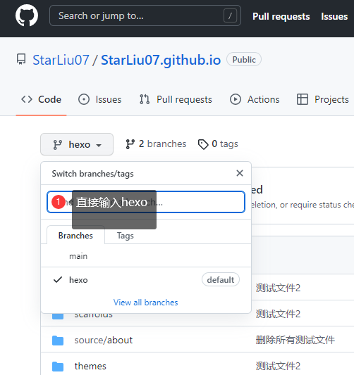
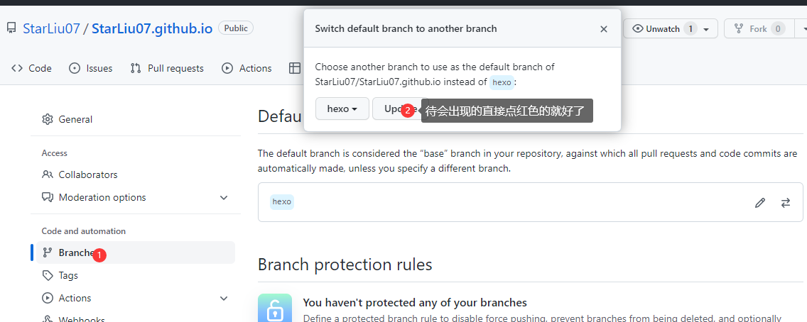
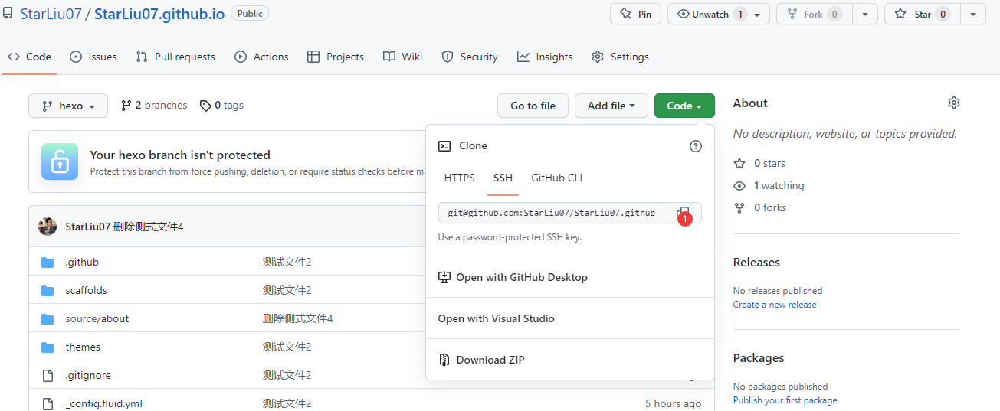

**一些小废话**

本来挺想有有一个属于自己的个人博客的，但是对于我这个萌新来说门槛有点高，而且服务器也买不起。(っ °Д °;)っ不过幸好看见群里有个大佬说能用github直接搭一个个人博客,还不用买服务器,那可太香了!所以就琢磨了一下怎么搭建.( •̀ ω •́ )✧

具体的搭建方法我在CSDN上找了一篇[教程](https://blog.csdn.net/yaorongke/article/details/119089190)很详细,所以我这边暂时偷个懒直接放个链接,后面有时间再自己写一篇.这一篇主要讲一下如果你以后换了一台电脑或者想在另一台电脑上继续写博客应该怎么办.

## 一.在github创建hexo分支

先说一下基本思路:在github上创建一个hexo分支,里面存放一些数据啥的,当你换了台电脑的时候你就只需要将这个分支上的内容clone到本地再继续写就可以了.

> 1.创建新分支hexo
>
> 2.将hexo设置为默认分支

### 1.创建默认分支

打开github找到你之前搭建的仓库(这里默认已经搭好了),然后创建新分支hexo:

### 2.将hexo设置为默认分支

创建好了hexo分支后,还要把它设置成默认分支,找到Settings(设置),找到branchs(分支),然后切换默认分支为hexo:



## 二.把hexo分支上的内容clone到本地

> 1.用git clone把文件克隆到本地

### 1.用git clone把文件克隆到本地

随便找个地方打开git,把github上的文件clone到本地.

> git clone ssh

clone后面的ssh就是在github仓库的Code里面可以直接复制

这个时候你就可以在本地写博客了.

## 三.发布博客的准备工作

> 1.下载必要文件
>
> 2.git push
>
> 3.发布到博客

### 1.下载必要文件

如果这个是你第一次创建个人博客的话,那么你就还需要再初始化一下.在刚才clone下来的仓库上打开git,依次输入

> npm install hexo
>
> hexo init
>
> npm install
>
> npm install hexo-deployer-git

注意这个时候的分支应该为hexo,而_config.yml中的deploy参数分支应该为main.

### 2.git push

然后你就可以按照正常推送到github上的流程走了,在git中依次输入

> git add .
>
> git commit -m "备注信息"
>
> git push origin hexo

### 3.发布博客

输入完后你打开github会发现在我们创建的博客已经在仓库中了,但是在我们搭建的个人博客上却没有出现,这时候就只需要输入

> hexo g -d

过个一分钟左右(个人博客似乎有些延迟)在刷新,就会发现你的博客出现在上面啦(～￣▽￣)～
